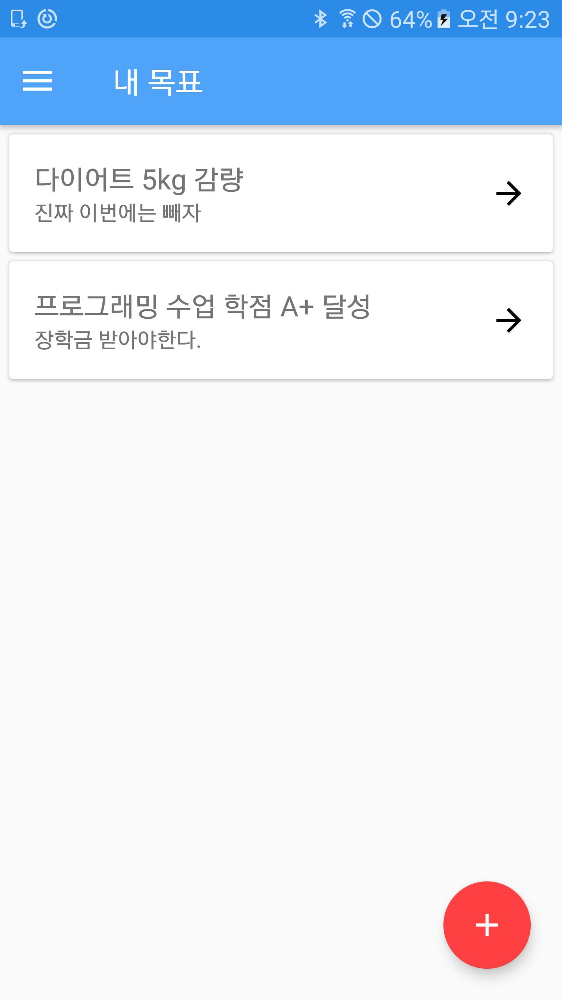

# 만 시간의 법칙
만 시간동안 어떤 일을 하면 전문가가 될 수 있다고 합니다. 이 앱은 당신이 만시간을 채울 수 있도록 도와주는 앱으로 주단위로 할일을 설정하고 수행할 수 있도록 도와줍니다 :)

## 주요기능
- 나의 목표 추가/삭제/수정하기
- 나의 목표 상세보기
- 나의 목표 수행하기
- 나의 목표 공유하기 (Firebase 사용)
- 다른 사람 목표 다운받기

## 주요화면
| 나의 목표 화면  | 새로운 목표 만들기 화면 | 목표 수행현황 화면 | 목표 공유 화면 |  
| ------------- | ------------- | ------------- | ------------- |
|   |   |   |   |

## 구현
- [Clean Architecture](https://github.com/android10/Android-CleanArchitecture) 를 참고하여 프로젝트의 틀을 잡고 Rxjava, Requery(Android ORM)로 비지니스 로직을 구현함
- Android Annotation 을 활용하여 클래스 간 의존성을 주입하는 코드를 없애고 코드 다이어트 함
- 다른 사람들과 목표를 공유하는 기능은 Firbase 실시간 데이터베이스를 활용함 또한 Firebase로 일일 사용자 방문 수를 확인하고 치명적 버그를 발견 및 수정하고 있음  

## 디렉토리 구조
- src  
    - model : Model 레이어
        - dto : 사용자에게 전달한 데이터를 담는 클래스
        - domain : 앱 도메인 클래스 (목표, 유저, 공유한 목표 등)
        - usecase : 각종 비지니스 로직 클래스 (나의 목표 추가/삭제/수정하기 등)
    - infrastructure : 안드로이드 시스템 및 파이어베이스와 같은 외부 시스템 의존 클래스 (알람 리시버, 알람 매니저 등)
    - presenter : Presenter 레이어
    - view : View 레이어 (안드로이드 액티비티, 뷰 컴포넌트)
  